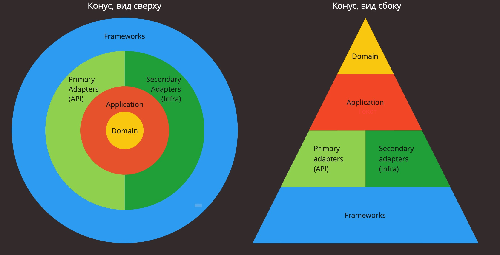
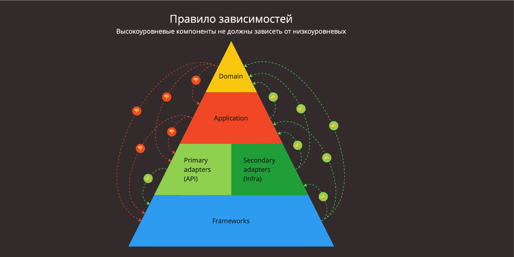

# Simple Chat

## Архитектура

В основе архитектуры микросервиса лежат принципы Clean Architecture и Hexagonal Architecture, обеспечивая четкое
разделение логики и инфраструктуры. На диаграмме показаны уровни, на которые разделено приложение:



- **Domain layer**: Содержит бизнес-правила и сущности, такие
  как `Chat`, `Message`
- **Application layer**: Вызывает бизнес-логику, находящуюся в бизнес
  сущностях и взаимодействуюет с другими компонентами системы через интерфейсы.
- **Primary adapters layer (Presentation)**: Точки входа в приложение. Принимают входные данные от пользователя и
  упаковывают их в форму, удобную для application layer, затем возвращают данные в форме, удобной для их отображения
  пользователю.
- **Secondary adapters layer (Infrastructure)**: Содержит технические инструменты (такие как репозитории, доступ к
  внешним API/сервисам, брокеры сообщений, платформы и т.д.) и адаптирует ввод/вывод к интерфейсу, который соответствует
  потребностям application layer.
- **Frameworks**: Фреймворки, инструменты, технологии, библиотеки и т.д.

#### Цель

Создание системы, обладающей следующими характеристиками:

- **Независимость от фреймворков**. Архитектура не зависит от наличия какой-либо библиотеки. Это позволяет рассматривать
  фреймворки как инструменты, вместо того чтобы стараться втиснуть систему в их рамки.
- **Простота тестирования**. Бизнес-правила можно тестировать без пользовательского интерфейса, базы данных, веб-сервера
  и любых других внешних элементов.
- **Независимость от пользовательского интерфейса**. Пользовательский интерфейс можно легко изменять, не затрагивая
  остальную систему. Например, веб-интерфейс можно заменить консольным интерфейсом, не изменяя бизнес-правил.
- **Независимость от базы данных**. Можно поменять на MongoDB, BigTable, CouchDB или что-то еще.
  Бизнес-логика не привязана к базе данных.
- **Независимость от любых внешних агентов**. Бизнес-логика ничего не знает об интерфейсах, ведущих во внешний мир.

Главным правилом, приводящим эту архитектуру в действие, является правило зависимостей:
*Зависимости в исходном коде должны быть направлены внутрь, в сторону высокоуровневых политик.*



#### Взаимодействие системы с внешним миром

У приложения есть 2 точки взаимодействия с внешним миром:

1. **Primary adapters (Presentation)**: адаптеры, которые управляют приложением реализуют взаимодействие с системой.
   Например, через REST API, телеграм бота, очередь сообщений, CLI, и т.п. Клиенты таких адаптеров могут быть конечные
   пользователи, микросервисы, консьюмеры очередей сообщений, технические пользователи, крон джобы и т.д.
2. **Secondary adapters (Infra)**: адаптеры, управляемые приложением реализуют взаимодействие системы с внешними
   зависимостями - БД, инжектор зависимостей, очередь сообщений, внешние интеграции по HTTP.

## Развертывание

Приложение поддерживает контейнеризацию и может быть развернуто в любой современной облачной среде или на собственных
серверах.

#### Запуск

Собрать и запустить текущий проект локально:

```shell
make run-local
```

5. Перейти к документации API: [http://localhost:1010/api/docs](http://localhost:1010/api/docs)

#### Тестирование

Собрать тестовое окружение и запустить тесты:

```shell
make test
```

#### Стандарты кода

В проекте поддерживаются строгие стандарты кодирования, которые обеспечиваются с помощью линтеров и форматировщиков.

Запустить линтеры, форматтеры и тесты одной командой:

```shell
make check
```
